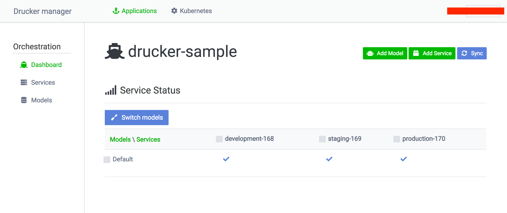

# Rekcurd-dashboard

[](https://travis-ci.com/rekcurd/dashboard)
[](https://badge.fury.io/py/rekcurd-dashboard)
[](https://codecov.io/gh/rekcurd/dashboard "Non-generated packages only")
[](https://pypi.python.org/pypi/rekcurd-dashboard)

Rekcurd dashboard is the project for managing ML model and deploying ML module. Any Rekcurd service is manageable. It can deploy the Rekcurd service to Kubernetes cluster and can control traffic weights which Istio manages.


## Parent Project
https://github.com/rekcurd/community


## Components
- [Rekcurd](https://github.com/rekcurd/rekcurd-python): Project for serving ML module.
- [Rekcurd-dashboard](https://github.com/rekcurd/dashboard): Project for managing ML model and deploying ML module.
- [Rekcurd-client](https://github.com/rekcurd/python-client): Project for integrating ML module.


## Screen shot



## Environment
- Python 3.6
- flask 1.0.x
- [Node.js](https://nodejs.org/) 8.x
- [yarn](https://yarnpkg.com/)


## Installation
From source:

```bash
$ git clone --recursive https://github.com/rekcurd/dashboard.git
$ cd dashboard/frontend
$ yarn install && yarn run build && cd ..
$ pip install -e .
```

From PyPi directly:

```bash
$ pip install rekcurd-dashboard
```


## How to use
Check the belows in detail.
- [Backend](./rekcurd_dashboard/README.md)
- [Frontend](./frontend/README.md)

##### Generate settings
You can generate the template of `settings.yml` file.
```bash
$ rekcurd_dashboard template
```

##### Boot command
```bash
$ rekcurd_dashboard db --settings settings.yml init
$ rekcurd_dashboard db --settings settings.yml migrate
$ rekcurd_dashboard server --settings settings.yml
```

##### docker-compose (Deprecated)
```bash
# For dev
$ docker-compose -f docker-compose/docker-compose.develop.yaml up
# For prod
$ docker-compose -f docker-compose/docker-compose.production.yaml up
```

##### For AWS users
If you run this on AWS (such as EKS), you need to configure aws-cli setting.  
Follow the [official document](https://docs.aws.amazon.com/streams/latest/dev/kinesis-tutorial-cli-installation.html).  

**Rekcurd-dashboard docker container will mount the configuration files,  
so the IAM account used by configuration needs to have enough permissions to access to Kubernetes resources on AWS.**

```bash
# For dev
$ docker-compose -f docker-compose/aws/docker-compose.develop.yaml up
# For prod
$ docker-compose -f docker-compose/aws/docker-compose.production.yaml up
```

## How to use WebUI
See [docs](./docs/README.md) in detail.


## Test
### Unittest
```bash
$ python -m unittest test/*/test_*
```

### e2e test
```bash
## sudo sh scripts/kube-init.sh
$ sudo sh e2e_test/startup.sh
$ python -m unittest
$ sudo sh e2e_test/cleanup.sh
```


## Kubernetes support
Rekcurd can be run on Kubernetes. See [community repository](https://github.com/rekcurd/community).
