# How to use
Dashboardを起動したら、あなたの[Rekcurd](https://github.com/rekcurd/rekcurd-python)をdashboardから管理することができます。バックエンドにKubernetesを用いる場合は、dashboardからKubernetesにあなたの機械学習サービスをdeployします。

## Top
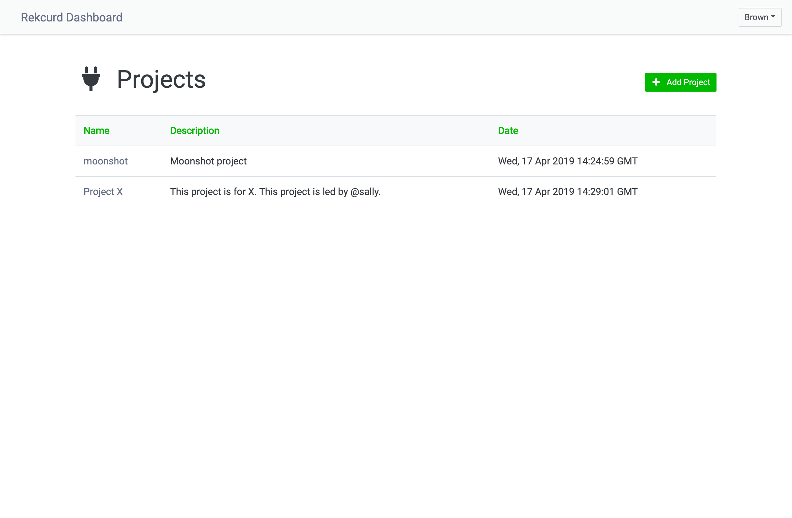

DashboardはProject単位の管理機能を提供します。ユーザーに対するアクセス権限をProjectごとに付与できます。ユーザーにProjectのアクセス権限がない場合、ユーザーは当該Projectのコンテンツを見ることはできません。

## Project
Projectには、Applications, Kubernetes, Data Servers, Adminの4つの管理画面があります。

### Applications

Applicationとは機械学習サービスの管理単位です。Applicationの各機能は[こちら](#application)を参照ください。

### Kubernetes
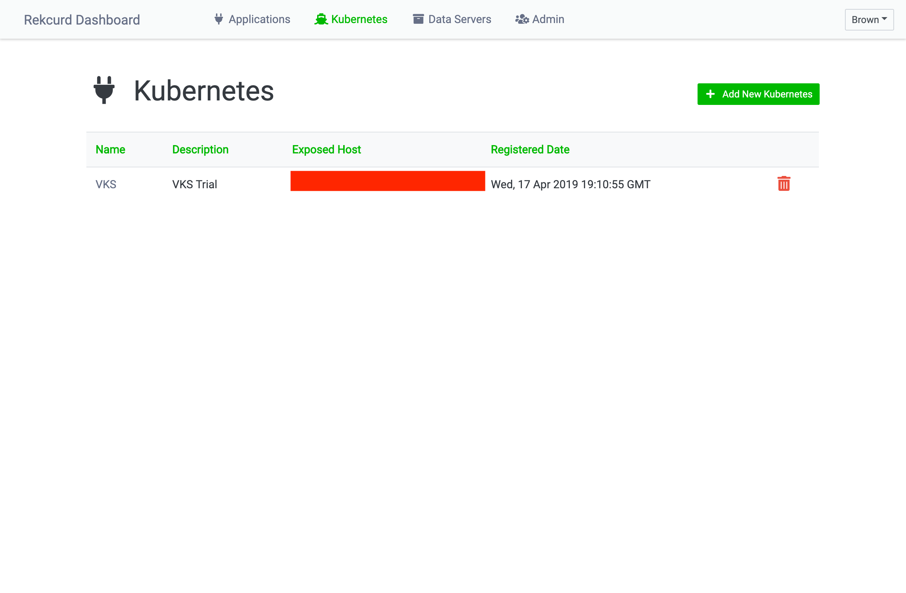

Kubernetesクラスタの管理画面です。バックエンドにKubernetesを用いる場合に利用します。Dashboardは複数のKubernetesクラスタを登録できます。Dashboardから機械学習サービスをdeployした場合、自動的にすべてのKubernetesクラスタに機械学習サービスをdeployします。

##### Add/Edit Kubernetes
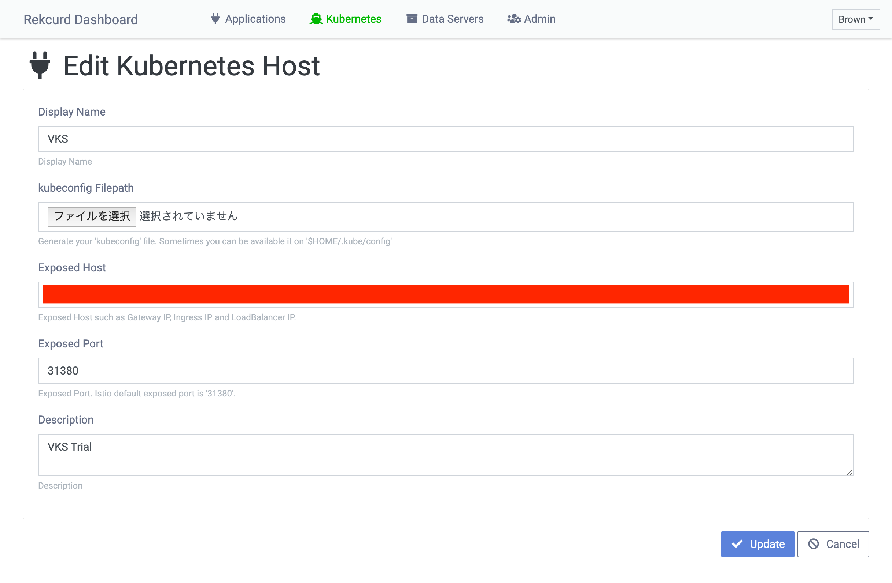

Kubernetesクラスタの登録および編集画面です。Kubernetesにアクセスするため、`kubeconfig`ファイルを登録します。`Exposed Host`はKubernetesクラスタへのアクセスポイントです。`Exposed Port`はIstioが設定したport numberで、デフォルトでは`31380`になります。

### Data Servers
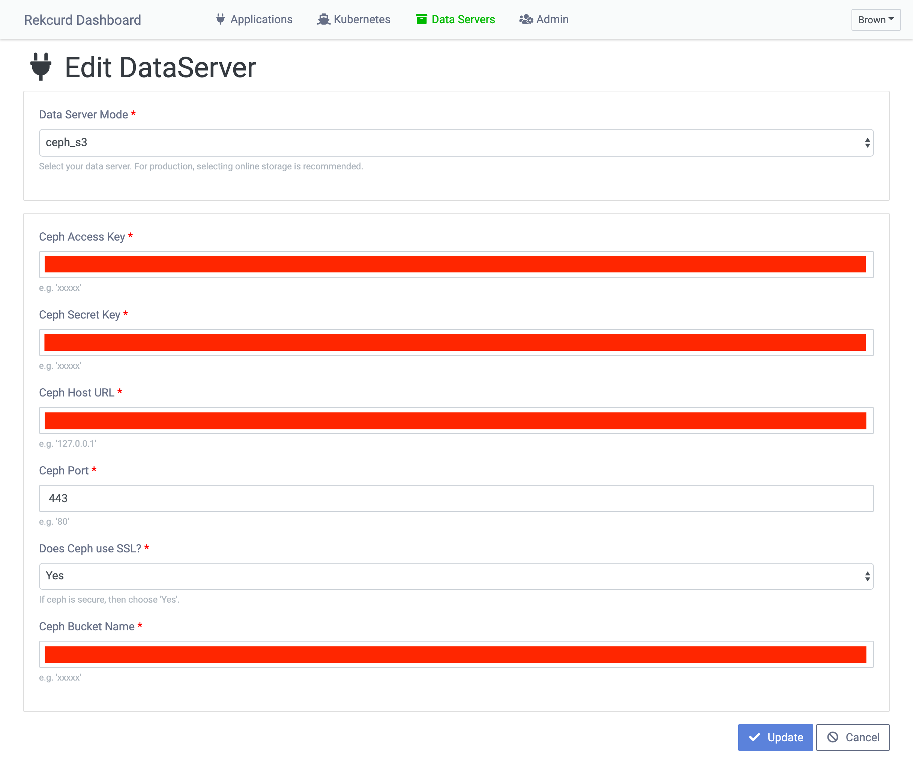

Data Serverは機械学習モデルやQAデータを任意のストレージに保存する機能です。`Local`は稼働中の機械学習サービスにデータを保存します。`Ceph S3`と`AWS S3`はWebAPI経由でOnline storageにデータを保存します。ProductionではOnline storage (`Ceph S3`, `AWS S3`) の利用を推奨します。

### Admin
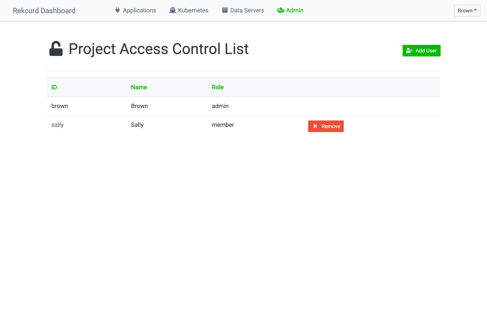

Projectのアクセスコントロールです。`admin`と`member`のみが当該Projectにアクセスできます。Project作成ユーザーが自動的に`admin`になります。デフォルトは"アクセス権限なし"です。

## Application
Applicationには、Dashboard, Services, Models, Routing, Adminの5つの管理画面があります。

### Dashboard

Dashboardは機械学習サービスを一元管理します。機械学習サービスがどのモデルで動いているかを確認できます。チェックボックスをクリックすると、チェックした機械学習サービスやモデルを削除できます。

##### Switch Models
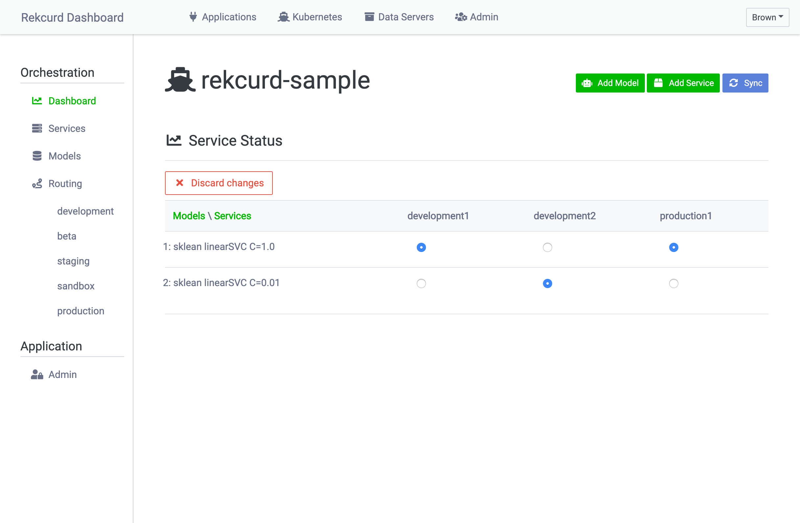

"Switch Models"から機械学習モデルの切り替えができます。複数の機械学習サービスのモデルを一気に切り替えることができます。バックエンドがKubernetesの場合は、Rolling-deploymentが実行されます。

### Services
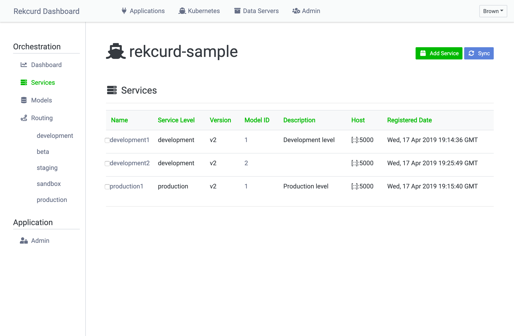

機械学習サービスの一覧画面です。チェックボックスをクリックすると、チェックした機械学習サービスを削除できます。

##### Add/Edit Service
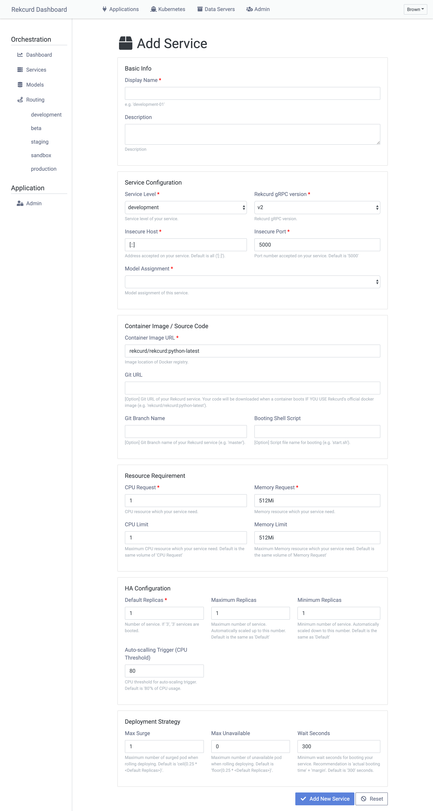

"Add Service"からサービスの登録ができます。バックエンドにKubernetesを使う場合は、Kubernetesに新規サービスをdeployします。各種パラメータの説明は以下を確認ください。

|Category |Field |Description |
|:---|:---|:---|
|Basic Info |Display Name* |Display name. |
| |Description |Description. |
|Service Configuration |Service Level* |Service level of your service. |
| |Rekcurd gRPC version* |Rekcurd gRPC version. |
| |Insecure Host* |Address accepted on your service. Default is all ('[::]'). |
| |Insecure Port* |Port number accepted on your service. Default is '5000'. |
| |Model Assignment* |Model assignment of this service. |
|Container Image / Source Code |Container Image* |Image location of Docker registry. |
| |Git URL |Git URL of your Rekcurd service. Your code will be downloaded when a container boots IF YOU USE Rekcurd's official docker image (e.g. 'rekcurd/rekcurd:python-latest'). |
| |Git Branch Name |Git Branch name of your Rekcurd service (e.g. 'master'). |
| |Booting Shell Script |Script file name for booting (e.g. 'start.sh'). |
|Resource Requirement |CPU Request* |CPU resource which your service need. |
| |Memory Request* |Memory resource which your service need. |
| |CPU Limit |Maximum CPU resource which your service need. Default is the same volume of 'CPU Request'. |
| |Memory Limit |Maximum Memory resource which your service need. Default is the same volume of 'Memory Request'. |
|HA Configuration |Default Replicas* |Number of service. If '3', '3' services are booted. |
| |Maximum Replicas |Maximum number of service. Automatically scaled up to this number. Default is the same as 'Default'. |
| |Minimum Replicas |Minimum number of service. Automatically scaled up to this number. Default is the same as 'Default'. |
| |Auto-scalling Trigger (CPU Threshold) |CPU threshold for auto-scaling trigger. Default is '80'% of CPU usage. |
|Deployment Strategy |Max Surge |Maximum number of surged pod when rolling deploying. Default is 'ceil(0.25 * <Default Replicas>)'. |
| |Max Unavailable |Maximum number of unavailable pod when rolling deploying. Default is 'floor(0.25 * <Default Replicas>)'. |
| |Wait Secondss |Minimum wait seconds for booting your service. Recommendation is 'actual booting time' + 'margin'. Default is '300' seconds. |

*Required

### Models
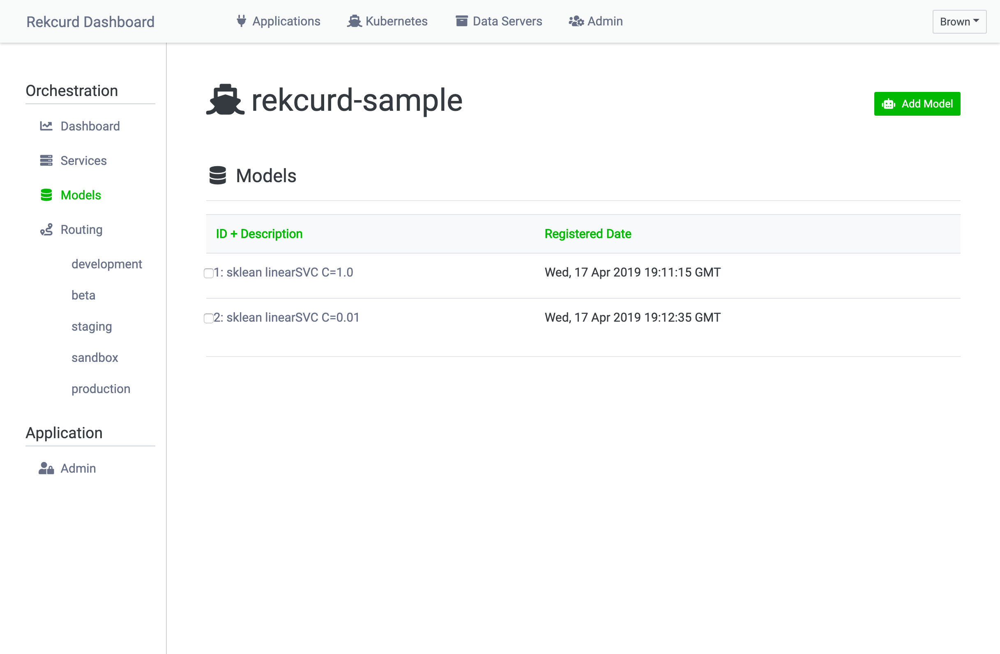

機械学習モデルの一覧画面です。チェックボックスをクリックすると、チェックした機械学習モデルを削除できます。

##### Add/Edit Model
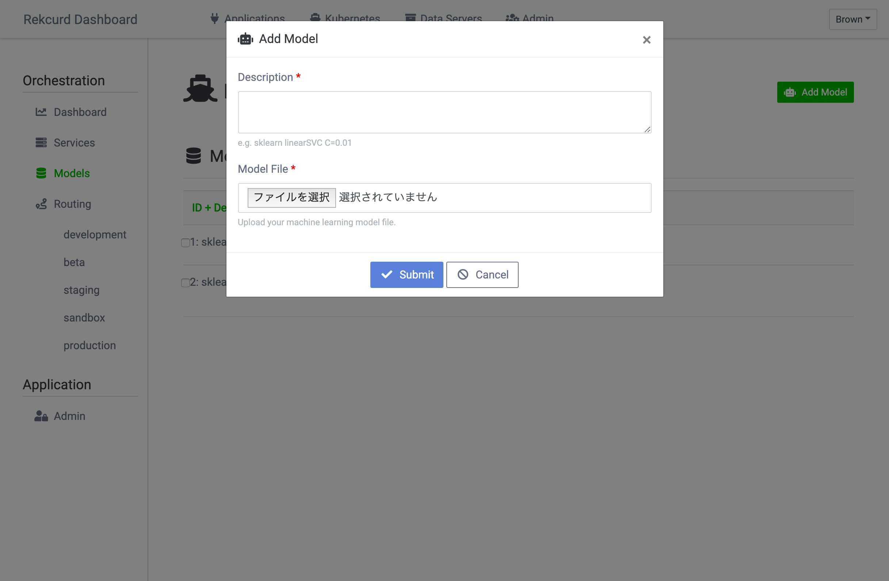

"Add Model"からモデルの登録ができます。`Description`にモデルの説明を書きましょう。

### Routing
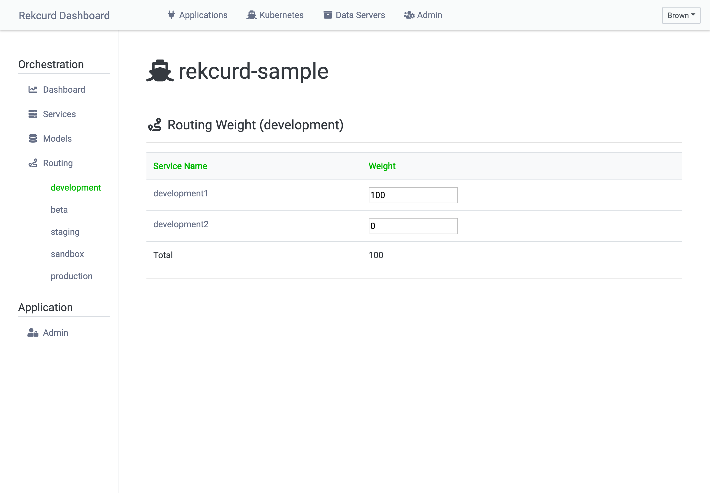

RoutingはTraffic Controlの管理画面です。Service Levelごとに管理します。主にABテストで用います。

##### Edit Routing
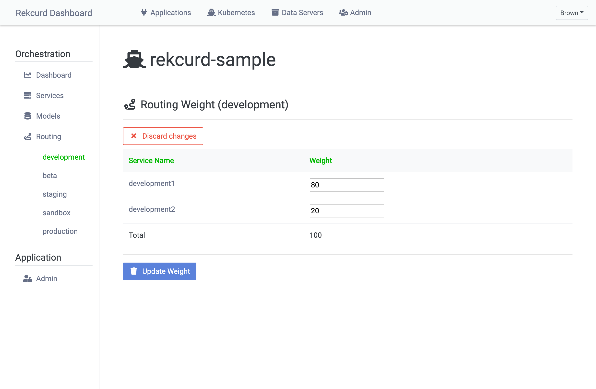

複数のモデルを配信した場合、任意の割合でTrafficをroutingできます。設定値はIntegerで合計は100です。

### Admin
Applicationのアクセスコントロールです。`admin`と`editor`のみが当該Applicationの各種変更ができます。Application作成ユーザーが自動的に`admin`になります。デフォルトは`viewer`で、閲覧権限があります。
