# How to use
After booting Rekcurd dashboard, you can manage your [Rekcurdize](https://github.com/rekcurd/drucker) ML service on it. If you have a Kubernetes, it can deploy your service to Kubernetes.

## Top
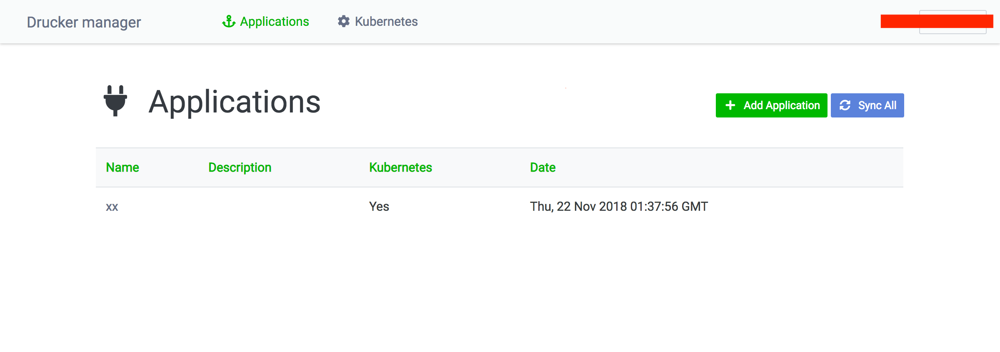

In our docker-compose file, Rekcurd dashboard is launched on `localhost:8080`. Top menu shows your applications. Application is a unit of ML module. Each application is a different ML module.

## Register Kubernetes
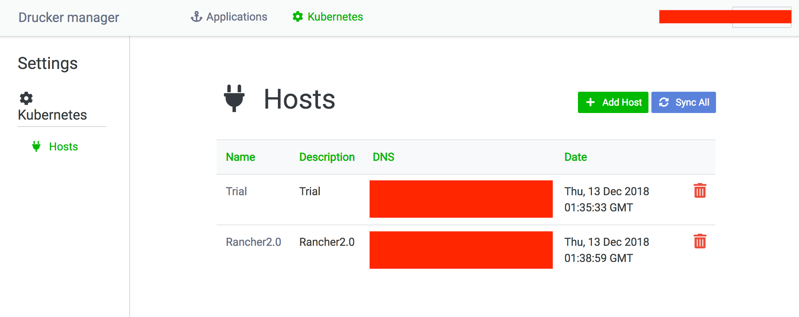

Rekcurd dashboard can control Kubernetes. Access `localhost:8080/settings/kubernetes/hosts`, and you can find your registered Kubernetes clusters there. "Sync All" starts to import the existing Rekcurd services on Kubernetes, and after that you can manage your all Rekcurd services by Rekcurd dashboard. "Add Host" can register new Kubernetes cluster on Rekcurd dashboard.

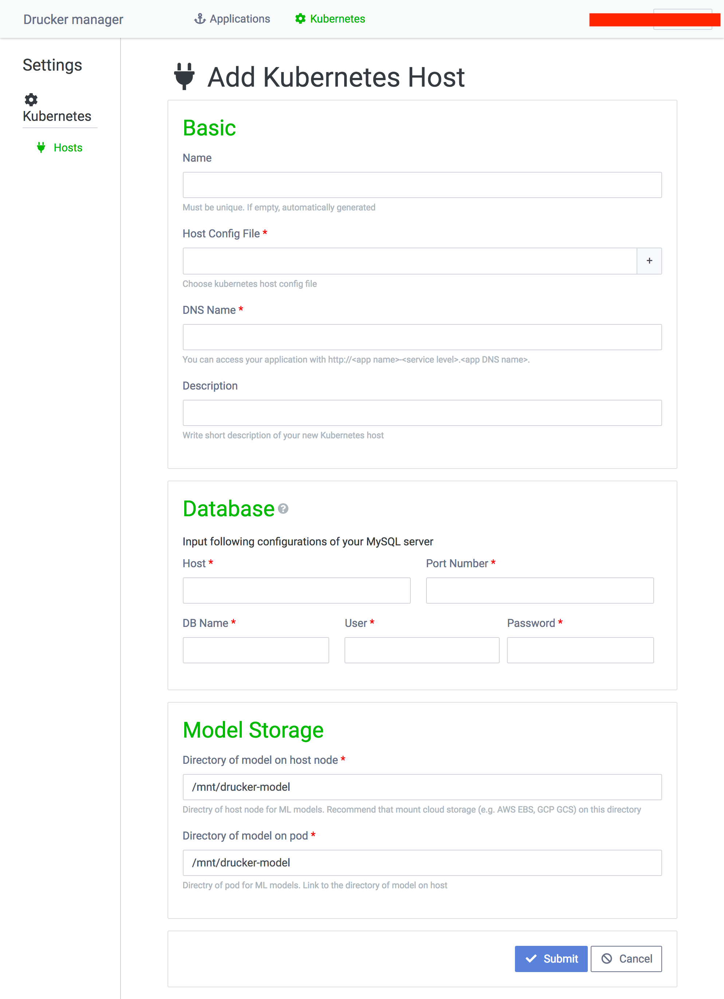

The fields you may fill is below.
|Category |Field |Description |
|:---|:---|:---|
|Basic |Name |Must be unique. If empty, automatically generated. |
| |Host Config File* |Choose kubeconfig file. Follow the [link](https://kubernetes.io/docs/tasks/access-application-cluster/access-cluster/) to generate your kubeconfig file. |
| |DNS Name* |You can access your application with http://<app name>-<service level>.<DNS name>. |
| |Description* |Write short description of your new Kubernetes host. |
|Database (MySQL) |Host* |Host. |
| |Port Number* |Port. |
| |DB Name* |DB name. |
| |User* |User. |
| |Password* |Password. |
|Model storage |Directory of model on host node* |Directry of host node for ML models. Recommend that you mount cloud storage (e.g. AWS S3, GCS, WebDAV) on this directory. Otherwise you cannot share the models between Pods. |
| |Directory of model on pod* |Directry of pod for ML models. This directory mounts the above directory. |

*Required

## Deploy application
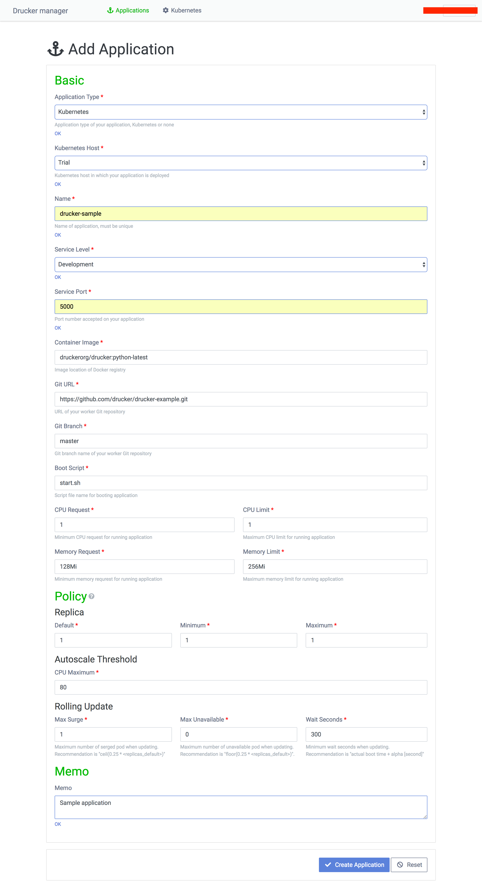

Access `localhost:8080/applications/add`, and you can deploy your [Rekcurdize](https://github.com/rekcurd/drucker) ML service to Kubernetes cluster. If you do not use Kubernetes, you can add the existing [Rekcurdize](https://github.com/rekcurd/drucker) ML service under Rekcurd dashboard.

|Category |Field |Description |
|:---|:---|:---|
|Basic |Application Type* |Application type of your application, Kubernetes or none. |
| |Kubernetes Host* |Kubernetes host in which your application is deployed. |
| |Name* |Name of application, must be unique. |
| |Service Level* |Choose from development/staging/production/beta/sandbox. |
| |Service Port* |Port number accepted on your application. |
| |Container Image* |Image location of Docker registry. You can use our official container image `rekcurd/rekcurd:python-latest`. |
| |Git URL* |Git repository URL of your Rekcurdize ML service. |
| |Git Branch* |Git branch name of your Rekcurdize ML service. |
| |Boot Script* |Script file name for booting application on your git repository home. |
| |CPU Request* |Minimum CPU request for running application. |
| |CPU Limit* |Maximum CPU limit for running application. |
| |Memory Request* |Minimum memory requrest for running application. |
| |Memory Limit* |Maximum memory limit for running application. |
|Policy |Replica default* |Default number of pod you want to boot. |
| |Replica minimum* |Minimum number of pod you want to keep. |
| |Replica maximum* |Maximum number of pod you want to keep. |
| |Autoscale Threshold CPU Maximum* |Threshold for auto scaling. If the workload exceeds this threshold, Kubernetes automatically deploy the Pod. |
| |Rolling Update max surge* |Maximum number of serged pod when deploying. Recommendation is "ceil(0.25 * <replicas_default>)". |
| |Rolling Update max unavailable* |Maximum number of unavailable pod when deploying. Recommendation is "floor(0.25 * <replicas_default>)". |
| |Rolling Update wait seconds* |Minimum wait seconds when deploying. Recommendation is "actual boot time + alpha [second]". |
|Memo |Memo* |You can write here. |

*Required

## Application dashboard

When you click an application link on top menu, you can access an application dashboard. This dashboard shows you all services and models. Service is the Kubernetes service, model is the ML model.

In the side menu on dashboard, there are three links; "Dashboard", "Services" and "Models". "Dashboard" is here. "[Services](#service-details)" is the page which lists all existing services. "[Models](#model-details)" is the page which lists all existing models.

In the body, "Add Model" is the function of [uploading ML model](#upload-ml-model), "Add Service" is the function of [deploying ML module](#deploy-application) and "Sync" starts to import the existing Rekcurd services of this application. "Switch models" is the function of [switching ML model of the Rekcurd service](#switch-ml-model). The checkbox of services/models is for [deleting service/model](#delete-servicemodel).

## Service details
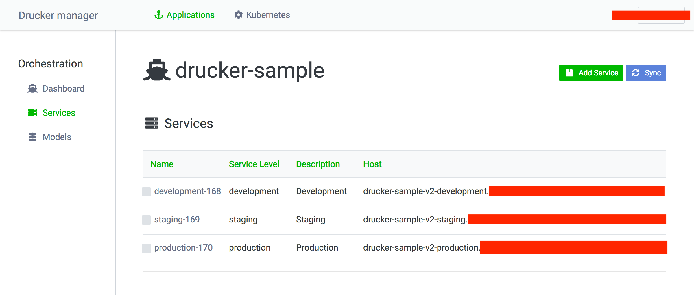

This page lists all existing services. You can [edit service configurations](#edit-service-configurations) by clicking the service name. You will find the access point of its Rekcurd ML service on "Host". It is convenient to use [Rekcurd client](https://github.com/rekcurd/drucker-client) which is a kind of SDK for all Rekcurd services.

## Edit service configurations
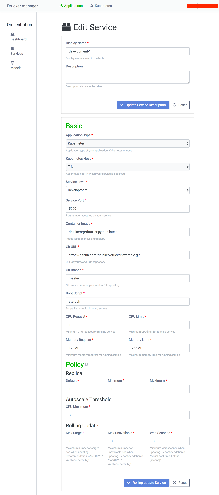

You can edit your service's configuration. "Update Service Description" is just a label for the display. "Rolling-update Service" is the trigger to request rolling update to Kubernetes. You don't need to change the configurations when you want to make a request of the rolling update.

## Model details
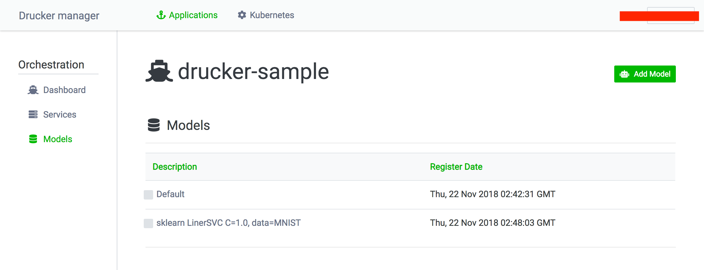

This page lists all existing models. You can edit model configurations by clicking the model name. 

## Upload ML model
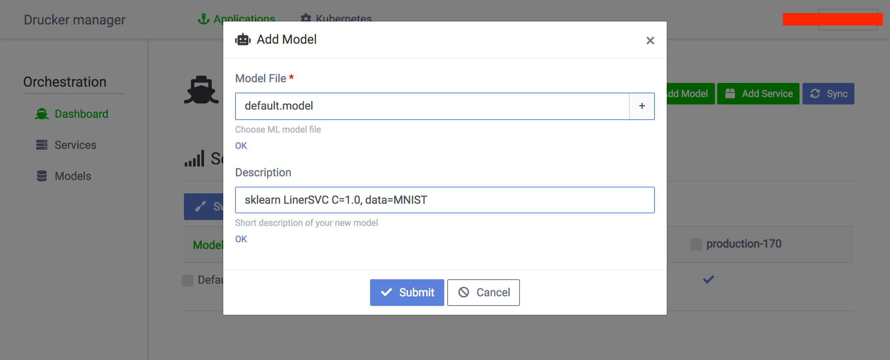

You can upload the ML model. Choose a model file and write a description. We recommend to include the training conditions, parameters and data in the description.

## Switch ML model
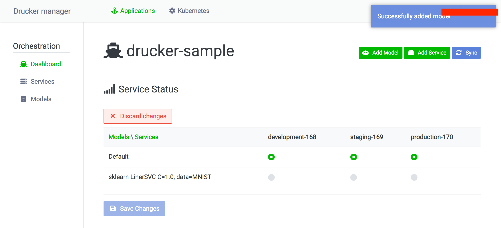

You can switch the model of the service by clicking radio button. After requesting "Save Changes", Rekcurd dashboard will make a request of rolling update to Kubernetes. "Discard change" is doing nothing.

## Delete service/model
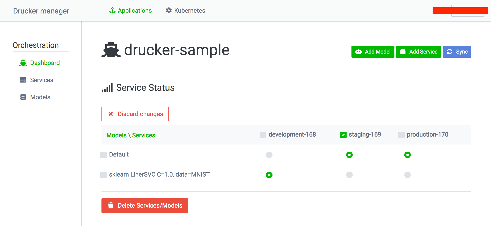

You can delete the existing services and models. After pushing "Delete Services/Models", the notification will arise. "Discard change" is doing nothing.

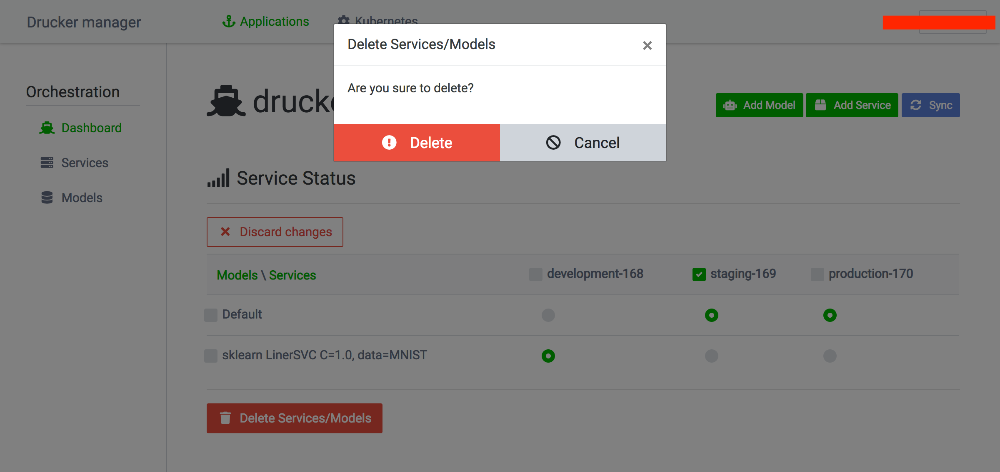

Make sure you really want to delete services/models here.

## AB test / Canary release
TBD. We will support [Istio](https://istio.io/) as known as the service mesh.
